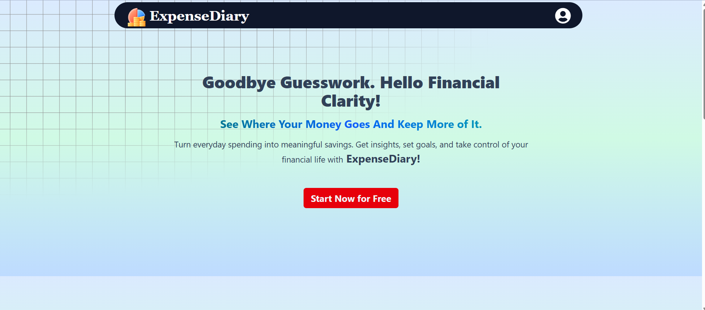
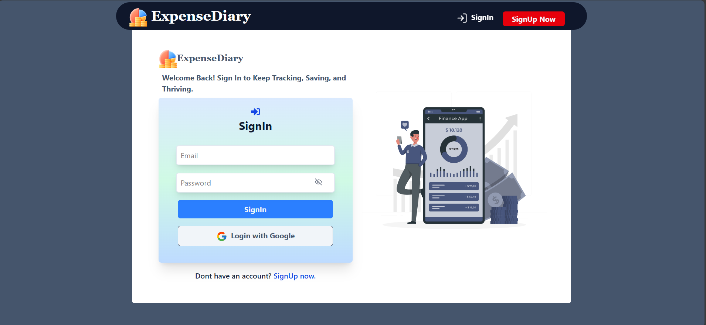
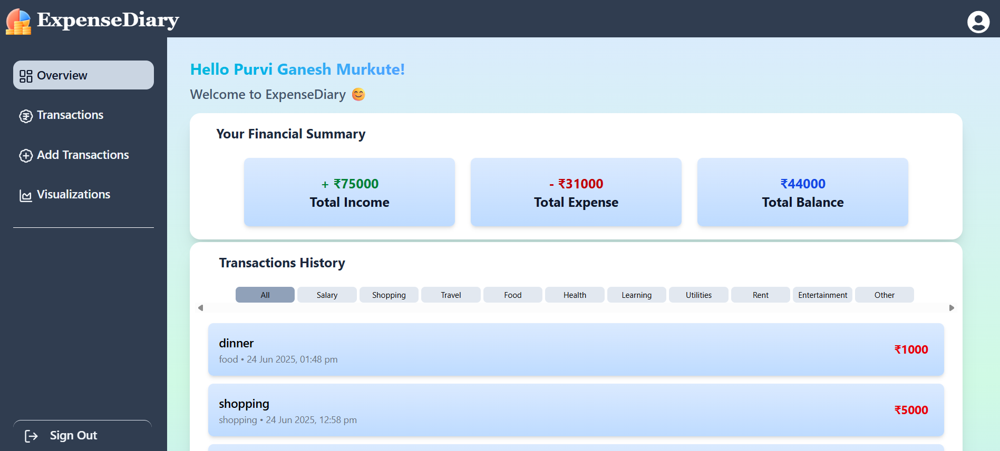

# ExpenseDiary (Expense Tracker)
Track your income and expenses with ease! A full-stack Expense Tracker web application built using the MERN (MongoDB, Express.js, React.js, Node.js) stack. Users can register, log in, and manage their daily transactions with a modern UI.

---

## 📸 Screenshots

### 🔐 Home Page

### 🔐 Login Page

### 📊 Dashboard

---
---

## 🚀 Features

- 🔐 User Authentication
     - Email/password using JWT
     - Google Login using Passport.js
- 📨 Welcome Email sent via Nodemailer when a user signs up or logs in for the first time
- ➕ Add, Edit, & ❌ Delete transactions (CRUD)
- 🗄️ Redis Caching for faster API responses and reduced database load
- 📂 Filter transactions by category
- 💵 View total balance, income, and expenses
- 📱 Responsive UI (Mobile & Desktop)
- 📊 Visual Insights with Pie Charts

---

## 🛠️ Tech Stack

### 🔧 Backend
- Node.js
- Express.js
- MongoDB
- JWT Authentication
- bcrypt for password hashing
- Passport + passport-google-oauth20 (Google Login)
- Nodemailer for email notifications
- Redis for caching

### 🖥️ Frontend
- React.js
- Tailwind CSS
- Axios for API calls
- Chart.js for data visualization
- react-hot-toast (Notifications)
- react-icons (Icons)
- framer-motion (Animations)
- react-router-dom (Routing)

---